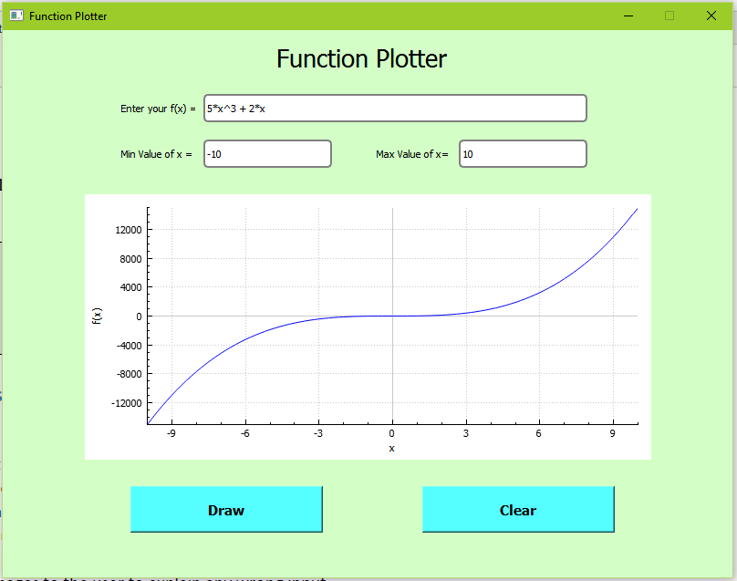

# Function_Plotter
This is a GUI program that plots arbitrary user-entered function of x.

*Supported Operations:
+  '+' , '-' , '*' , '/'

No '(' , ')' are supported..

## Some Correct Working examples:

