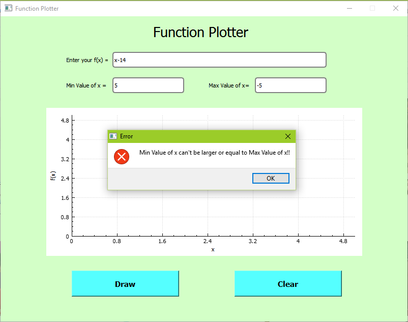

# Function_Plotter
This is a GUI program that plots arbitrary user-entered function of x.

*Supported Operations:
+  '+' , '-' , '*' , '/'

No '(' , ')' are supported..

## Some examples:

You can see all examples in the photos folder..

## How to run the code?
I am using QT C++
#### QT Installation:
- we need Qt5, use this link to download it
  - https://www.qt.io/download
  - choose download for open source users 
  - choose custom installation 
  and then proceed  to choose the following packages

  - qt 5.15.2
  - qt creator
  - debugging tools
  - mingw 8.1.0 64 bits
  - cmake 
  - ninja
  
  
  
  - proceed with the installation and click finish

